  

<h3 align="center">
  
</h3>

  Building systems, learning continuously, and creating technology that matters.

---

## 🧭 Summary

I'm a Computer Science & Software Engineering student at **BIUST**, focused on Artificial Intelligence, Cybersecurity, and Full-Stack Development. I'm currently building practical projects — an AI assistant, a developer community platform, and a security toolkit — while strengthening my engineering fundamentals toward becoming a technical founder.

- 🎓 CS & SWE @ BIUST — Expected 2028
- 🔭 Currently building: **NIA AI Assistant**, **The Code Order**
- 🌱 Learning: Advanced AI integration, applied cybersecurity, system design
- 🎯 Long-term goal: an ecosystem of software products, AI systems, developer communities, and games
- 📫 Reach me: [rossephraim228@gmail.com](mailto:rossephraim228@gmail.com)

---

## 🛠️ Tech Stack

**Languages**

**Frontend**

**Backend**

**Tools & Platforms**

---

## 🏆 Project Tier Ranking

A self-assessed rating of my projects — based on completeness, complexity, and real-world readiness, not just ambition. *(D = early idea → S = production-grade)*

| Project | Tier | Status | Notes |
|---|:---:|---|---|
| Personal Portfolio Website | **B** | Active | Live, functional, iterating on design |
| The Code Order | **C** | In Development | Core structure being built |
| NIA AI Assistant | **D** | Research & Planning | Scoping architecture and use cases |
| Cybersecurity Toolkit | **D** | Planning | Early-stage utility scripts planned |
| Hollow Knight Inspired Game | **D** | Concept | World & mechanics design phase |

> Tiers update as projects mature — this table is meant to track honest progress, not just intent.

---

## 📊 AI Engineer Dashboard

<table>
<tr>
<td>

**Focus Allocation**
- 🤖 AI/ML: `███████░░░` 35%
- 🔐 Security: `█████░░░░░` 25%
- 🌐 Full-Stack: `██████░░░░` 30%
- 🎮 Game Dev: `██░░░░░░░░` 10%

</td>
<td>

**Learning Roadmap**
- `2025–2026` Fundamentals + Portfolio
- `2026–2027` AI Integration + Security
- `2027–2028` Systems + Internships

</td>
</tr>
</table>

---

## 📈 GitHub Analytics

  
  

  

> The circular grade (e.g. A+ / A / B+...) is GitHub's own commit/PR/issue-based rank — it updates automatically as your real activity grows. No need to hand-edit it.

---

## 🔗 Connect With Me

---

<i>Currently leveling up from D-tier ideas to S-tier systems, one commit at a time.</i>

